Thematic Mapping
=======================
   
A popular way of presenting information about geographic patterns is to use a thematic map. A thematic map shows the spatial distribution of one or more specific data themes for selected geographic areas. The data may be quantitative (e.g., percentage population change, income distribution) or qualitative  (e.g., predominant farm types, mineral distribution in the USA, mountain ranges in the Americas).

With a GIS software, the basic way to create a vector thematic map is to identify the field in the attribute table of the map layer that will be used for mapping. Next, scrutinize the data to learn about its statistical distribution, then display it using the software's thematic mapping engine.  

Some amount of thought is required when mapping the data. If the data is quantitative, select one of the quantitative thematic mapping style, e.g., graduated color, proportional symbols, dot density, etc.   We also have to think about the color scheme for the map, the number of classes or bins into which the data will be placed, how the data will be classified, e.g., natural break, equal area, etc, and whether the data should be normalized.  If the data is qualitative, we create a qualitative thematic map, which may also vary in appearance depending on the details of the data.

|

Assignment
------------

1. Create a thematic choropleth map showing the geographic distribution of confirmed COVID-19 cases in the United States by counties as the situation existed on January 1, 2022.  The data for this exercise can be found at  this `Github link <https://github.com/hsemple/-Covid19/blob/master/USA-2.zip>`_.  Click on the *Download* button and download the both the Covid19_Jan2022_US_Counties.zip layer and the USA-2.zip layer.  

2. Follow instructions in Section 3.2 on this page to create the map. Your map should be complete with title, legend, scale bar, etc.  Use map design principles to make the map look attractive. 

3. Upload the zipped shapefile to ArcGIS Online then use it to create an interactive web map that is shared with the general public. .  Follow the instructions in Section 3.4 on this page to create the interactive map.

|

Creating a Choropleth Covid19 Thematic Map
------------------------------------------------------

1. After downloading the data, unzip or extract it to a location that you can remember.

2. Load the map layer into QGIS.

3. Right click on the name of the layer and select Open Attribute table. Inspect the attribute table. We will use the column that is named "Confirmed". This column contains whole numbers and represent the total raw number of confirmed cases per county. There is another field named "Confirmedb" which ontain floating-point numbers or decimals, suggesting it represent normalized values (e.g., cases per 100,000 people). Since we want to map the actual counts, we are using the "Confirmed" values.  Examine the population data, then close the attribute table.

4. Now, right click on the layer name again and choose ‘Properties’.

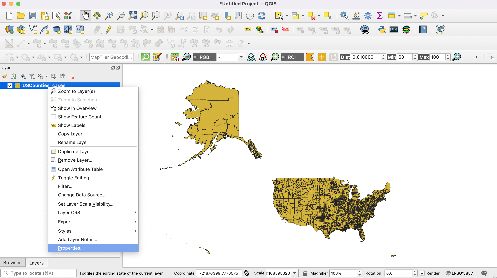
 

5. When the layer properties dialog opens, select the "Symbology" tab to the left of the dialog.

.. image:: img/mapping_attributes2.png
   :alt: QGIS Symbology Dialog

6. Click on the drop-down button at the top right of the Symbology dialog and you will see several options, e.g., Single Symbol, Categorized, Graduated, Rule Based, etc.

.. image:: img/mapping_attributes2b.png
   :alt: QGIS Symbology Dialog

.. image:: img/mapping_attributes3.png
   :alt: Mapping Attributes

7. The graduated style is used when you want to map fields in which the data are numerical quantities.  The graduated scheme will create choropleth maps, i.e., maps in which varying colors are used to represent different sized quantities.  Categorized is used when the values in the columns refer to categories of information, e.g. Democrats = 1, Republicans = 2, Independents = 3. In this case, the numbers 1,2, and 3 are not quantities, but categories.
 

8. To map the confirmed cases column, select Graduated as the Style.  Select "Confirmed" as the column to map. Click on the dropdown next to Color Ramp and select a color ramp. For numerical data that goes from lower values to higher values, one can select a single color ramp.  Lower values will be given a lighter version of the color while higher values will be given a darker version of the color.

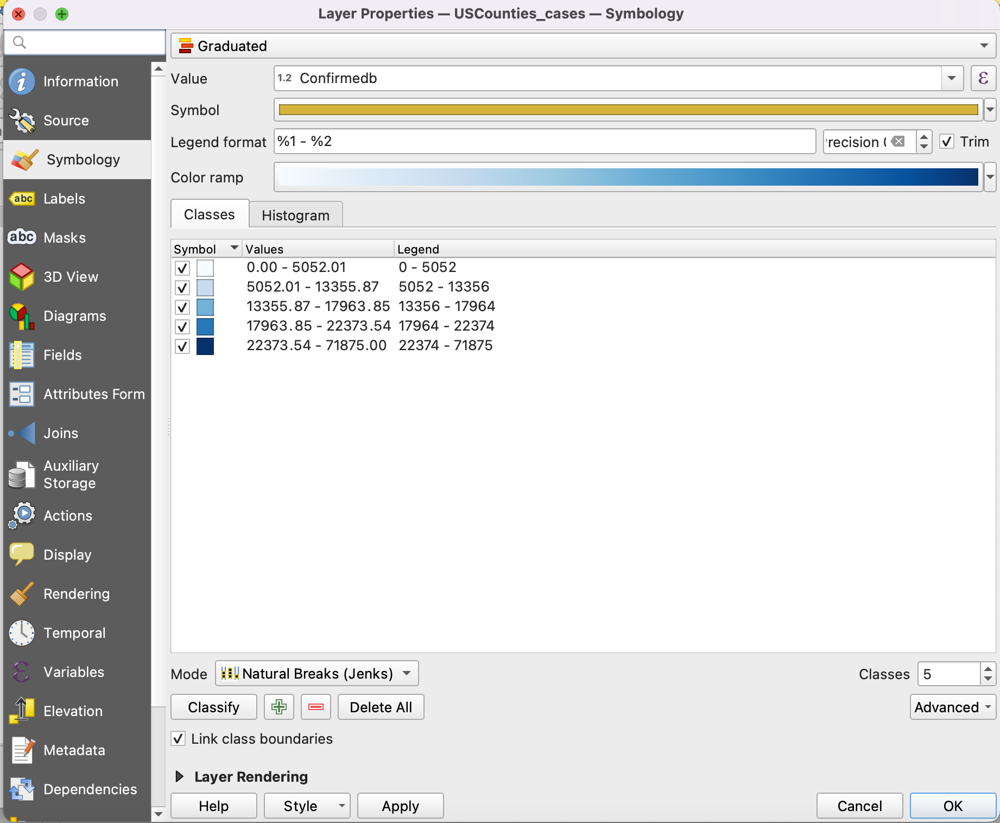

   

9. Select the default 5 as the number of classes. Most cartographers suggest 5-6 classes as providing the best results.  Since we selected five classes, QGIS will place the population totals of the 50 states into 5 groups.  

10. Next to "Mode", select "Natural Breaks" as the method of classification or grouping the data. Natural breaks means that the software will rank the data from highest to lowest and then create five groups such that each group contains numbers that are generally similar to each other. The goal is to create groupings of similar numbers rather than groups of equal number of cases. You can also experiment with equal interval, standard deviation, etc. to see their effect. Click Classify.  

11. You can also set the boundaries of the groups manually. Click on the Histogram tab then select Load Data.  You can now edit the class boundaries by moving the vertical lines with your mouse. You can also click on an empty space to add new class boundaries. 

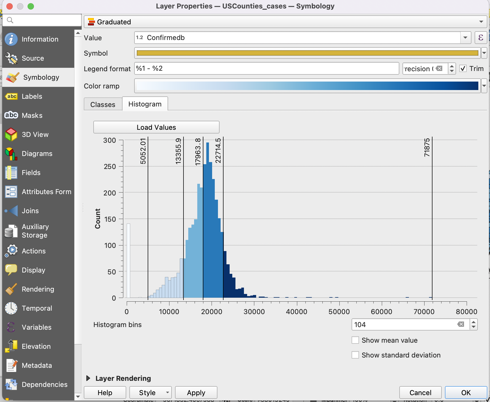

12. Next to Legend Format, %1 - %2 lets you control how you want the lower and upper numbers to appear in the legend. %1 is the lower number and %2 is the upper number.  "Precision" controls the number of decimal places that will appear in the legend while the Trim option removes excess trailing zeroes.

13. Click OK and view the map in the main QGIS window. This map definitely conveys a lot more useful information that just numbers in a table.  

 

14.  At this stage, you can download and add the States shapefile to your project. When you add the USA States layer onto the Canvas, it will  likely cover the county level layer entirely, so you have to make it transparent in order to see the outlines of the states plus the details of the county layer. 

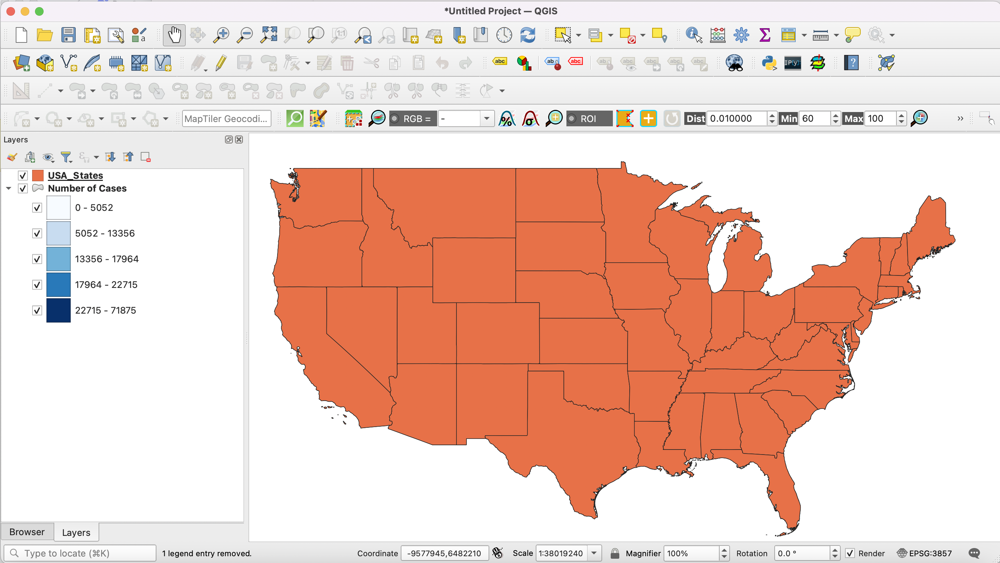

15. To make the state layer transparent, double click on the layer name icon in the Table of Contents, Select symbology  and set the color to transparent.  

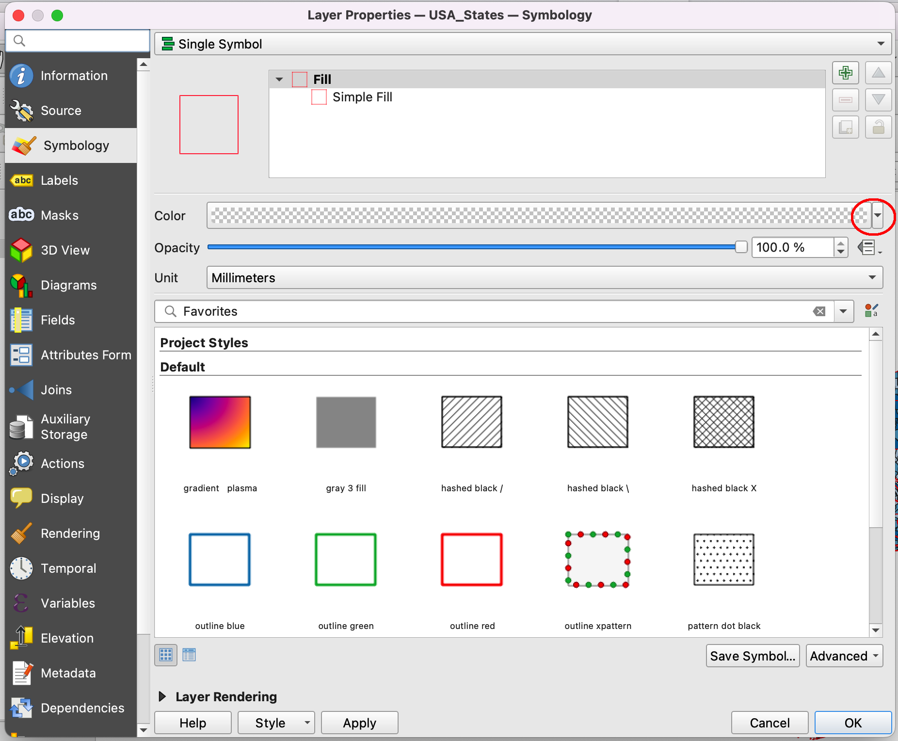

16. At this stage, you are done creating the map. The next stage is to prepare the map for for printing. This requires us to create a professional quality layout that will contain a map body, legend, scale bar, title, etc. Once this is done, the map can be printed.

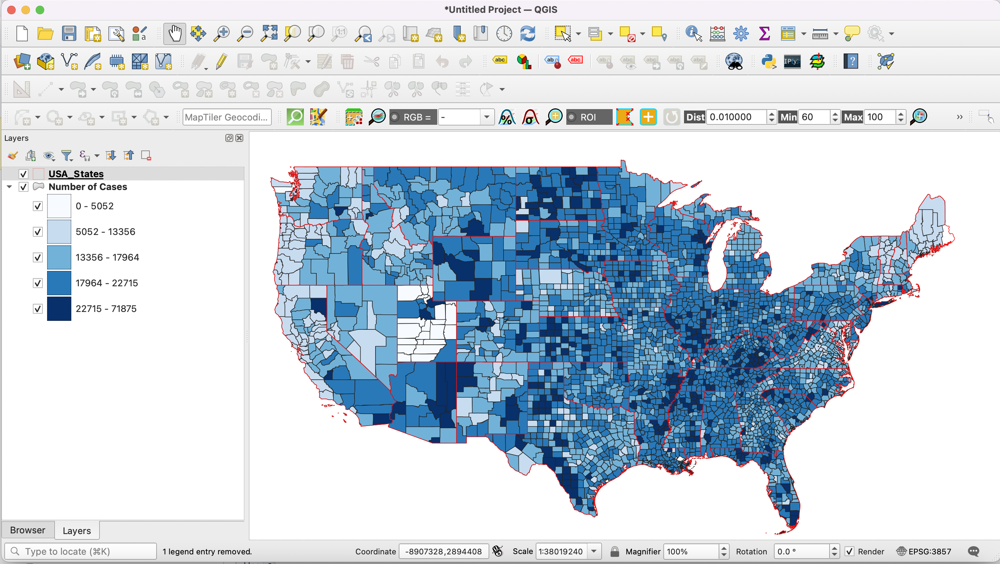

**Preparing the Choropleth Map for Printing**

1. Now that you are familiar with the process of creating a thematic choropleth map, the final step is "compose" the map for printing. This is the phase where your artistic skill comes into play. I strongly suggest that you look over the lecture notes on map design principles, as they provide important information on how to style your final map. You can also browse Internet resources for information on this topic. Key components of a professional map include:

   - The map body  
   - The title of the map  
   - The scale bar  
   - The north arrow  
   - The legend  
   - Data Source (optional)

2. QGIS comes with an application called "Composer" that is used to create professional quality layouts. 
 
 
3. With the map you are working on still opened in QGIS, click on Project on the main menu, then ‘New Print Layout'.  

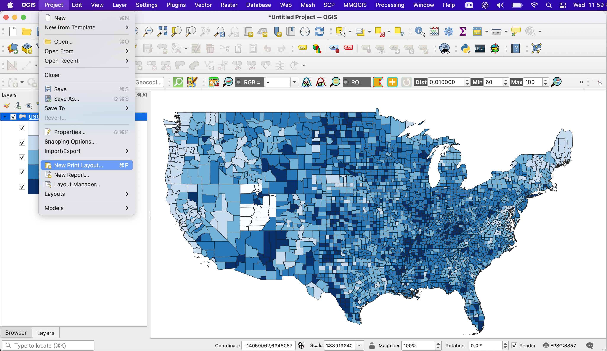

3. Enter a name for the new print composer object that will be created, e.g., "Distribution of Covid19 Cases, USA, Jan 2022". A new print Composer window will open.  You may have to use the Zoom button to adjust the size of the main map area of composer.

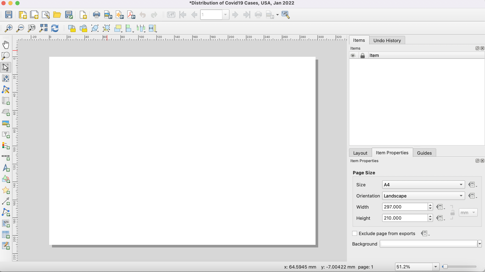

4. The Print Composer tool contains four main parts: (1) a menu at the top of the screen, (2) a toolbar to the left, (3) the main map area, which has blank canvas where you would be composing the map, and (4) a panel with three tabs to the right, Composition, Item Properties, and Guides.
 

5. To add a map to composer, click on Add Item on the main menu, then click "Add Map". Now draw a rectangle container on the canvas to hold the map.  When you end the rectangle, the map will appear.  Note: If you do not like the rectangle size, you can always resize it afterwards.
 

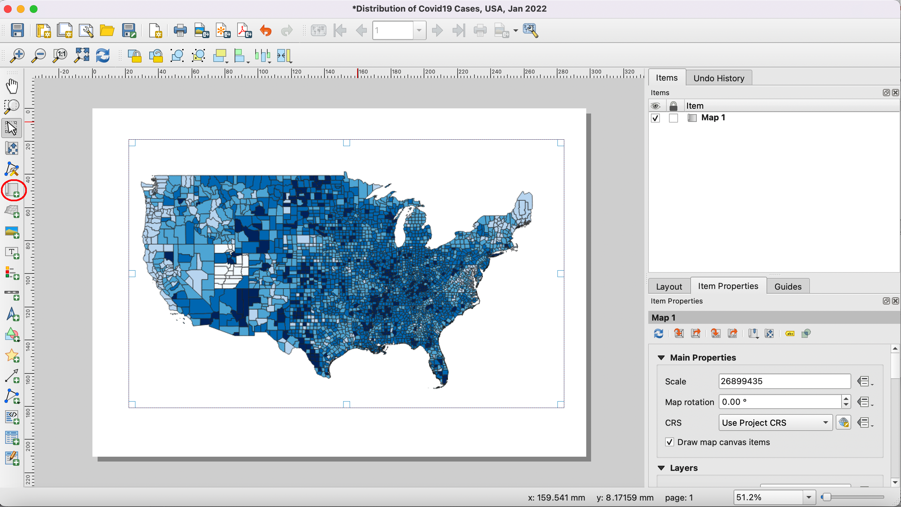

 
6. If you wanted to enlarge the map and show only the contiguous states, then go back to the map area, and enlarge the view there. You may have to delete the rectangle and redraw it.

7. Click inside the box and drag the map container until it is centered on the page. 

8. To add a scalebar, click on Add Item on the main menu, then select "Add Scalebar".  Draw a rectangle on the composition where you want to place the scale bar then release. The scalebar will appear. Resize the scalebar to suit your taste.
 

9. With the scalebar selected, click on "Item Properties" to the right of the composer. Here you can fiddle with the different values to adjust elements of the scalebar's appearance.
 

10. Repeat the same process as described in 8 above to add north arrow and legend to your map. Title and other text are added with the "Add Label" button on the Toolbar to the left.  Here is  view of my completed map.
 

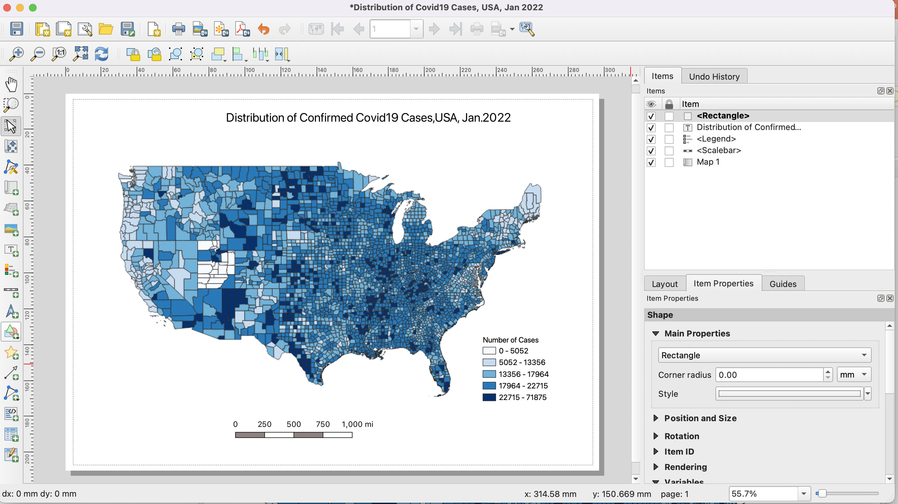

 
11. Once you are satisfied with the map, you can export it as Image, PDF or SVG. For this tutorial, let’s export it as a PNG image. Click onLayout | Export as Image.  Select a path and a name for the exported image.  This image can be uploaded to Canvas Dropbox.
 

12. Creating attractive maps requires knowledge about map design and map communication principles.  There is a large body of literature on elements of good map design. In Module 1.6,  I present some basic maps design ideas.  Please read these design ideas and try to integrate them as much as possible into your own map design. 
 

13. As a rule, always try to create beautiful maps that effectively communicate spatial information. Conversely, always try to avoid creating ugly maps that fail to effectively communicate useful information.

14. Submit this map as proof that you completed the tutorial.

|

Create an  Interactive Map of Covid19 Confirmed Cases in the US Using ArcGIS Online
-------------------------------------------------------------------------------------------------

1. Revisit the location where you stored the downloaded files from the last section. We will reuse the same data for this section. However, with ArcGIS Online, the data unzipped files will be used.

 

2. Visit  http://arcgis.com and log into using your ArcGIS Online account.

 

3. At the ArcGIS Online Homepage, click on Content.

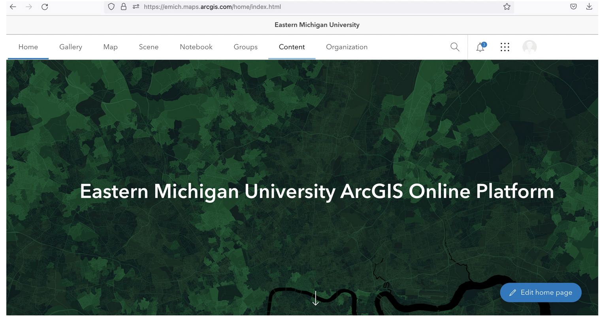

4. Click on New Item. When the dialog appears, select "Your Device", then navigate to where the zipped "Covid19_Jan2022_USA_Counties.zip" shapefile is located.

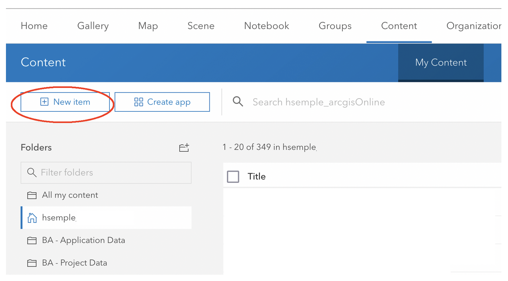

5. Select the file, fill out the dialog, click Next, then import the file. This process converts the shapefile into a format that can be easily displayed by browsers.

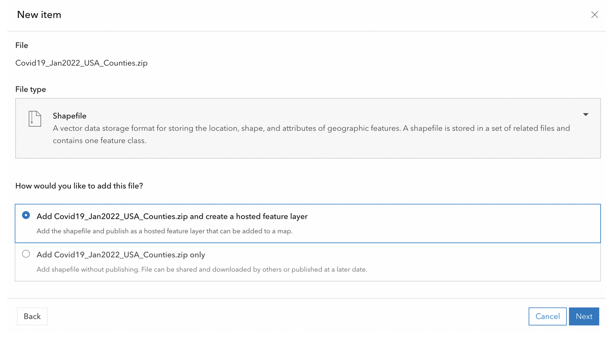

6. After the layer is imported, a page similar to the one below appears.  First, click on Share and share the file with the general public or with the members of your organization, i.e., members of EMU. 

 

7. Next, click on Open in Map Viewer.

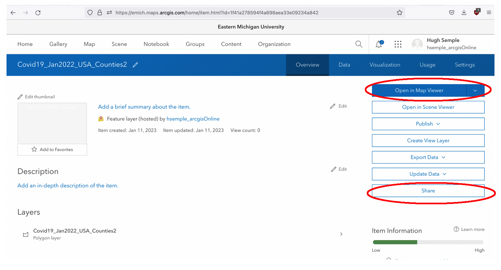

8. The map will open in Map Viewer. It should look similar to the illustration below.

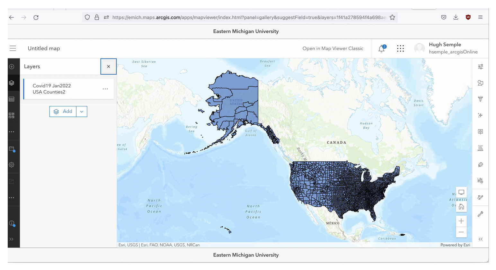

9. Center the map on the contiguous states.

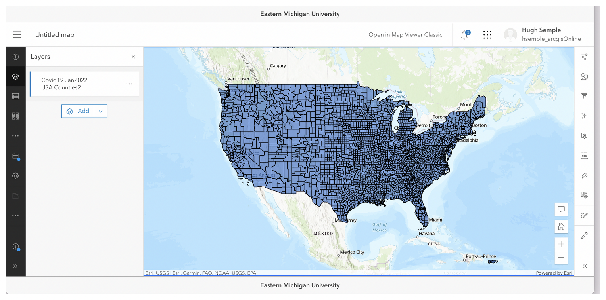

10. Now, let's map an attribute field.  Click on the Styles button to the right of the application, the click on Field. Browse to the field named "Confirmed" and select it.

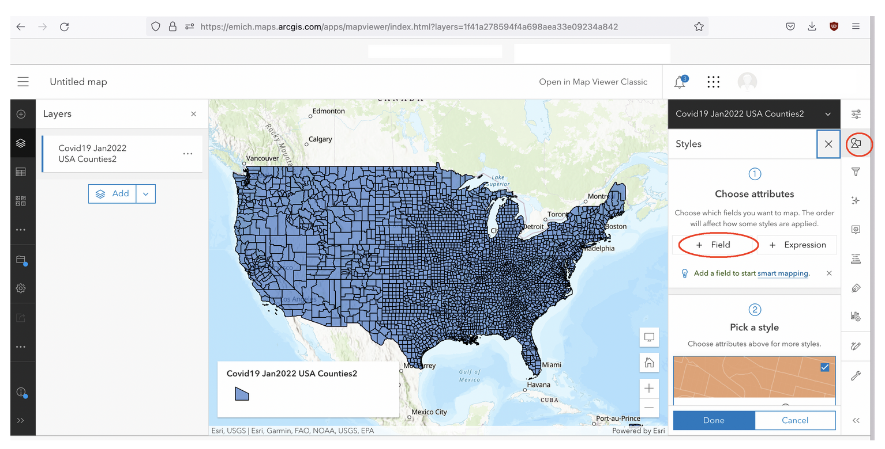

 
11.  After the map draws, click on the "Counts and Amounts (color)" style.

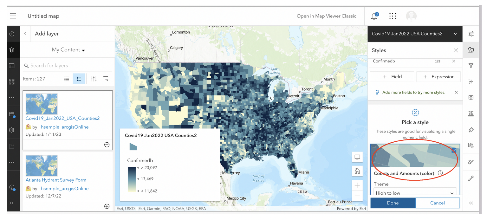

 
12. When the dialog appears, click on Symbol Style. In the Symbol Style dialog, set the outline color of the county boundaries on the map to black, adjust the transparency to about 50%, and set the outline width of lines to 1 pixel.  Click Done.

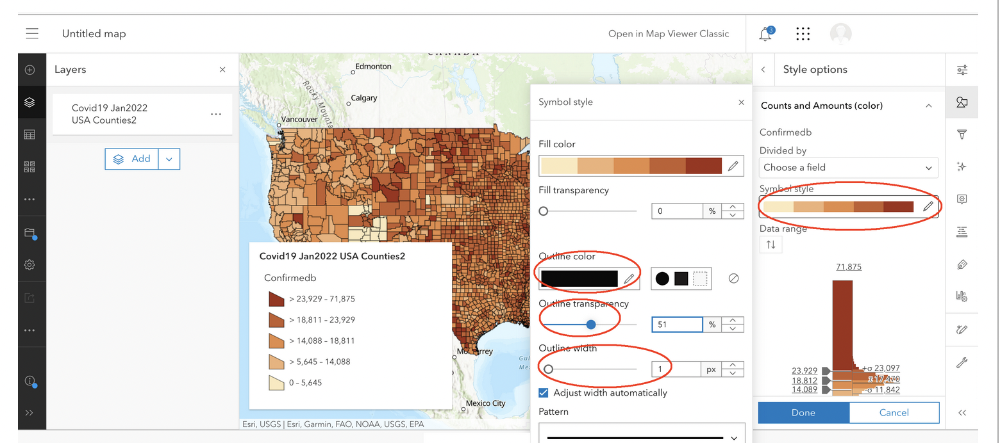

 
13. Save the map by clicking on the Save as button and filling out the dialog.

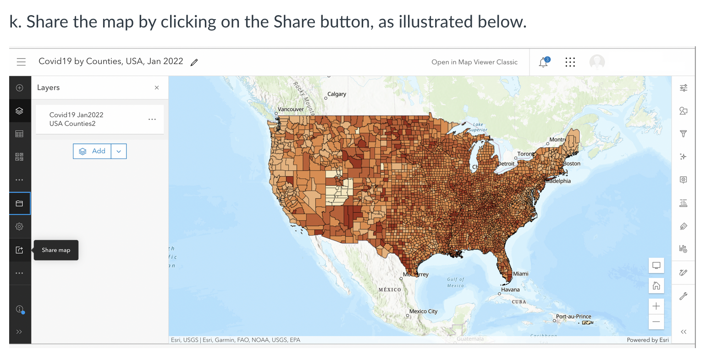

14. Share the map by clicking on the Share button, as illustrated below.

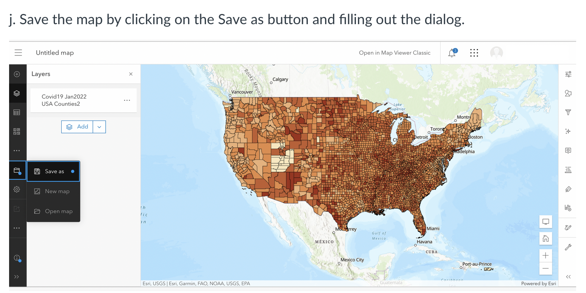

15. Copy the URL at the top of the page and submit it.

 
 |

**Tips**

1. Often, to enhance the appearance of your final map, you may need to edit the layer name and field name for display purposes.  Click on this [link](https://support.esri.com/en-us/knowledge-base/how-to-edit-the-map-legend-s-symbology-label-and-layer--000027803)
for information on how to make these changes.

 

 |

**Deliverables**

1. A professional quality thematic map showing Covid19 cases by counties in the USA. The map must must be well-laid out and have an easy to understand color scheme, a title, legend, scale bar, and north arrow.  Export the layout as an image and upload it to Canvas.

 

2. Professional Quality Interactive Web Map using ArcGIS Online. Map must use an appropriate color or symbol scheme. Legend must be edited. Submit the URL of the map.

|

Resources
----------

Covid19 datasets (csv files). These files must be joined to the shapefile's attribute table before creating the thematic map.
https://github.com/nytimes/covid-19-data

Create a Proportional Symbol Map and Legend Using QGIS 3.x (Youtube)
https://www.youtube.com/watch?v=lmw1AZPyXiY&t=320s

|

